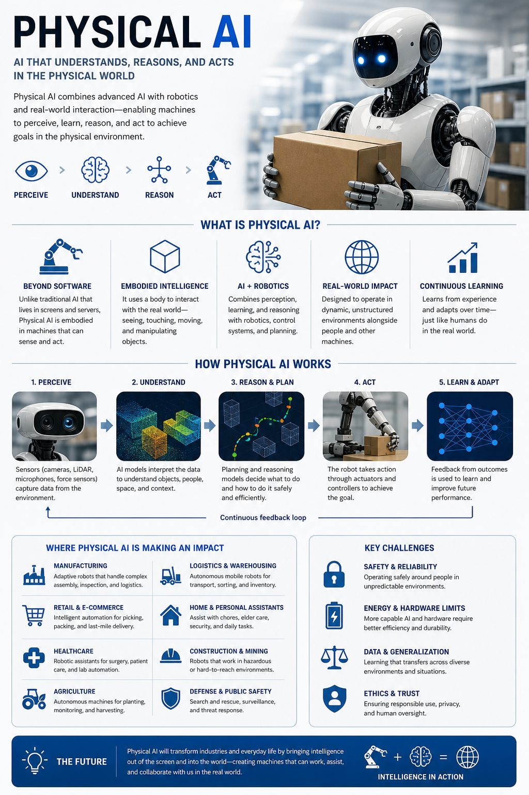
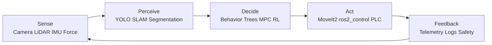

# Intelligent Robotics (Physical AI)



**Physical AI** is the discipline of building robots and autonomous systems that perceive the physical world through sensors, reason using AI models, and act through actuators — closing the loop between intelligence and the real world. This is the frontier of AI beyond language models.

**End Goal:** Build systems that go from `Sensor Input → Perception → Reasoning → Planning → Action → Feedback`

---

## Career Direction for This Phase

This phase is best treated as a specialization, not just a robotics overview.

- Target role: Physical AI / Robotics ML Engineer
- Best-fit environment: Finnish industrial robotics, automation, intelligent machines, and edge AI
- Career story to build: "I design perception, planning, and control systems for robots that operate in real environments."
- Best proof of skill: ROS2 repos, simulation-to-hardware demos, short videos, and one thesis or internship project tied to a real industrial use case

### Physical AI Loop



- Sense: sensors produce time-stamped measurements from the physical world
- Perceive: models and state estimation build a world model
- Decide: planners and policies choose the next safe action
- Act: controllers turn decisions into motion, torque, or industrial commands
- Feedback: telemetry, failure analysis, and retraining improve the loop

For a Finland-oriented roadmap, employer-aligned project ideas, and an 8-week starter plan, see [Finnish Physical AI Career Roadmap](./finnish-physical-ai-career-roadmap.md).

---

## 1. Foundations (Non-negotiable)

### Math

- Linear Algebra (vectors, matrices, transformations, rotation matrices, quaternions)
- Probability & Statistics (for ML, sensor noise modeling, Kalman filters)
- Basic Calculus (optimization, gradients)
- Geometry & Trigonometry (coordinate frames, 3D space, transformations)

### Programming

- Python (main — prototyping, ML, ROS nodes, data pipelines)
- C++ (critical for real-time ROS2 nodes, performance-sensitive code)
- Linux / Bash (robots run Linux; terminal fluency is non-negotiable)

### Core topics

- Data structures and algorithms
- Linux basics (you already use VM → good)
- Git version control for robotics projects
- Docker (containerize your robot software stack)

---

## 2. Core AI & Machine Learning

- Supervised learning (Regression, Classification)
- Model evaluation (Precision, Recall, F1, RMSE)
- Feature engineering
- Scikit-learn

Then move to:

- Deep Learning (PyTorch preferred)
- CNNs (for vision)
- Transfer learning

**Why it matters for Physical AI:** Every perception model, grasp predictor, and policy network is an ML model. Understanding training, evaluation, and deployment is foundational.

---

## 3. Computer Vision

This is the eyes of physical AI.

- OpenCV
- Image processing (thresholding, contours, morphology)
- Object detection (YOLO, Faster R-CNN)
- Image classification
- Segmentation (semantic, instance — U-Net, Mask R-CNN)

Advanced:

- Depth estimation (monocular and stereo)
- Multi-camera systems and calibration
- Real-time inference pipelines (optimize for FPS on edge hardware)
- 3D point cloud processing (Open3D, PCL)
- Foundation vision models: SAM (Segment Anything), CLIP, DINO

---

## 4. Spatial Intelligence

Spatial intelligence bridges perception and action — converting what the camera sees into where things are in the robot's world.

- Coordinate systems: pixel space → camera frame → robot frame → world frame
- Camera calibration (intrinsic & extrinsic parameters with OpenCV)
- Homography and perspective transforms
- Pose estimation (6DoF: position + orientation)
- Eye-in-hand vs eye-to-hand calibration

Example pipeline:

```
Detect object (u, v in pixels)
→ Deproject using depth + intrinsics → (X, Y, Z) in camera frame
→ Transform via TF tree → (X, Y, Z) in robot base frame
→ Robot moves to pick/interact
```

- TF2 in ROS2 (transform tree, `tf2_ros`, `TransformBroadcaster`)
- ArUco markers for ground-truth pose reference

---

## 5. Robotics & Control Systems

Connect AI → real world through robot control.

### Kinematics
- Forward kinematics (joint angles → end-effector pose)
- Inverse kinematics (desired pose → joint angles)
- Denavit-Hartenberg (DH) parameters
- Libraries: `robotics-toolbox-python`, MoveIt2

### Control
- PID control (position, velocity, force control)
- Joint-space vs task-space control
- Trajectory generation and interpolation

### Planning
- Motion planning: RRT, RRT*, PRM
- Collision avoidance, workspace limits
- MoveIt2 for arm motion planning

**Tools:**

- ROS2 (VERY IMPORTANT) — nodes, topics, services, actions, lifecycle nodes
- Gazebo / simulation — test everything in sim before hardware
- Robot APIs (like Dobot MG400, UR robots, Franka Panda)
- RoboDK — offline programming for industrial robots
- Beckhoff Automation — industrial PLC + TwinCAT for factory robots

---

## 6. Sensors & Hardware

Physical AI ≠ only software.

### Sensors to understand:
- RGB cameras (USB, CSI, GigE industrial)
- Depth cameras (Intel RealSense, Azure Kinect, Zed2)
- LiDAR (2D and 3D — Velodyne, Ouster, RPLidar)
- IMU (accelerometer + gyroscope, used for SLAM and stabilization)
- Force/torque sensors (for contact-aware manipulation)
- Tactile sensors (cutting edge — feel for grasping)

### Hardware platforms:
- Microcontrollers: Arduino (actuation, I/O), ESP32 (wireless IoT)
- Single-board computers: Raspberry Pi (edge AI host), Jetson Nano/Orin (GPU edge AI)
- Industrial PLCs: Beckhoff TwinCAT (factory automation)

### Communication protocols:
- UART, I2C, SPI (microcontroller level)
- MQTT (IoT/sensor streaming — connects to section 10 IoT project)
- EtherCAT (industrial real-time bus — Beckhoff)
- CAN bus (automotive/robot joint motors)

---

## 7. Real-Time Systems

Real-time performance separates lab demos from production robots.

- Multithreading in Python (`threading`, `asyncio`) and C++ (`std::thread`)
- Latency profiling and optimization (measure before you optimize)
- Edge AI: run inference locally on Jetson/Raspberry Pi (no cloud dependency)
  - TensorRT for NVIDIA Jetson (model optimization)
  - ONNX Runtime (cross-platform inference)
  - OpenVINO (Intel edge hardware)
- Streaming pipelines for sensor data
- ROS2 real-time: `rclcpp` with real-time executors, DDS QoS tuning

**Target:** Vision inference at 30+ FPS; end-to-end loop (sense → decide → act) under 100ms

---

## 8. AI + Cloud Integration

- Google Cloud (BigQuery for robot data logs, Vertex AI for training)
- APIs (Gemini, OpenAI — for language-conditioned robot commands)

Extend with:

- Edge + cloud hybrid deployment (run perception on edge, upload to cloud for retraining)
- Real-time inference APIs (FastAPI — expose model as a microservice)
- Data logging + monitoring (Grafana + InfluxDB for robot telemetry — see section 10)
- Robot fleet management concepts

---

## 9. System Design

Think like an engineer.

**Design pipelines like:**

```
Camera → Perception Model → Spatial Transform → Motion Planner → Robot Controller → Actuator → Sensor Feedback Loop
```

Should be able to explain:

- Data flow through the full system
- Failure modes at each stage (occlusion, calibration drift, latency spikes, IK failures)
- Latency budget (how long each stage takes, where to optimize)
- Scalability (single robot → fleet)
- Safety (E-stop logic, collision detection, force limits)

---

## 10. Physical AI — Foundation Models & Embodied AI (Frontier)

This is the cutting edge — where LLMs meet robotics. Study this after mastering sections 1–9.

### What is Embodied AI?
Training AI models that learn to act in the physical world through experience — not just text/image but actions, sensor inputs, and robot trajectories.

### Key Concepts:
- **Imitation Learning (IL):** Robot learns by watching human demonstrations (teleoperation data)
- **Behavior Cloning (BC):** Supervised learning on (observation → action) pairs
- **Reinforcement Learning (RL):** Robot learns via reward signal (sim-to-real transfer)
- **Vision-Language-Action (VLA) Models:** Multimodal models that map vision + language → robot actions

### Key Models & Frameworks:
| Model/Tool | Description |
|-----------|-------------|
| [LeRobot (HuggingFace)](https://github.com/huggingface/lerobot) | Unified toolkit for robot learning: ACT, Diffusion Policy, TDMPC2 |
| RT-2 (Google DeepMind) | Vision-language-action model — robot understands natural language commands |
| π0 (Physical Intelligence) | Generalist robot policy trained on diverse manipulation data |
| OpenVLA | Open-source vision-language-action model for robot manipulation |
| ACT (Action Chunking Transformer) | Imitation learning for precise manipulation (used in LeRobot) |
| Diffusion Policy | Diffusion model for learning robot action distributions |
| Isaac Lab (NVIDIA) | GPU-accelerated robot learning sim (successor to Isaac Gym) |
| Genesis | Fast physics sim for robot learning (PyTorch-native) |

### Hands-On Path with LeRobot:
1. Set up LeRobot environment (Python + PyTorch)
2. Load a pre-trained policy on a benchmark (PushT, ALOHA)
3. Collect teleoperation demonstrations on a low-cost robot (SO-100, Koch v1.1)
4. Train ACT or Diffusion Policy on your own data
5. Evaluate and deploy on the physical robot

### Data Collection for Physical AI:
- Teleoperation: leader-follower arm setup
- HDF5 datasets, LeRobot dataset format
- Data augmentation for robot learning (domain randomization in sim)
- Dataset scale matters: 50+ demos for simple tasks, 500+ for complex

---

## Hands-On Project Milestones

Work through these progressively to build real Physical AI skills:

| Level | Project | Key Skills |
|-------|---------|-----------|
| Beginner | Camera calibration + ArUco pose estimation | Spatial intelligence, OpenCV |
| Beginner | Real-time object detection on webcam (YOLO) | CV, edge inference, FPS optimization |
| Intermediate | Pick-and-place in Gazebo simulation | ROS2, MoveIt2, kinematics, TF2 |
| Intermediate | Vision-guided robot arm (detect → grasp) | Full perception-action pipeline |
| Advanced | Collect demos + train behavior cloning policy | LeRobot, imitation learning |
| Advanced | Sim-to-real transfer (train in Isaac Lab, run on physical robot) | Domain randomization, RL |
| Advanced | Language-conditioned manipulation ("pick the red block") | VLA models, natural language control |

---

## Tools & Ecosystem Summary

| Category | Tools |
|----------|-------|
| Robot middleware | ROS2, micro-ROS |
| Simulation | Gazebo, Isaac Lab, Genesis, RoboDK |
| Manipulation | MoveIt2, robotics-toolbox-python |
| Computer vision | OpenCV, PyTorch, YOLO, SAM, CLIP |
| Depth sensing | Intel RealSense SDK, Open3D |
| Edge AI | TensorRT, ONNX Runtime, OpenVINO |
| Embodied AI | LeRobot, ACT, Diffusion Policy |
| Industrial | Beckhoff TwinCAT, UiPath RPA |
| Simulation (industrial) | RoboDK, Wokwi |
| Data logging | InfluxDB + Grafana, ROS2 bags |
| Cloud | NVIDIA Omniverse, GCP Vertex AI |

### Simulation & Industrial Tools — Detailed

| Tool | Description |
|------|-------------|
| [ROS2](https://github.com/ros2) | Robot Operating System 2 — open-source middleware for building and scaling robot applications across platforms (nodes, topics, services, actions) |
| [Gazebo](https://gazebosim.org/docs/all/getstarted/) | Physics-based robot simulation — test everything in simulation before deploying on hardware |
| [LeRobot (HuggingFace)](https://github.com/huggingface/lerobot) | "Hugging Face for Robotics" — unified open-source toolkit for robot learning: ACT, Diffusion Policy, TDMPC2 |
| [RoboDK](https://robodk.com/) | Offline programming and simulation software for industrial robots — supports 500+ robot models |
| [Beckhoff Automation](https://www.beckhoff.com/fi-fi/) | Industrial PLC and TwinCAT real-time control system — Industry 4.0 and factory automation |
| [UiPath RPA](https://www.uipath.com/rpa/robotic-process-automation) | Robotic Process Automation — automate repetitive software tasks in enterprise workflows |
| [Wokwi](https://wokwi.com/) | Online electronics and microcontroller simulator — Arduino, ESP32, Raspberry Pi Pico simulation in the browser |

---

## Resources

* [NVIDIA Physical AI Learning](https://docs.nvidia.com/learning/physical-ai/index.html)
* [LeRobot Documentation](https://github.com/huggingface/lerobot)
* [ROS2 Official Tutorials](https://docs.ros.org/en/humble/Tutorials.html)
* [The Construct ROS2 Courses](https://app.theconstruct.ai/)
* [Manipulation (Russ Tedrake, MIT)](https://manipulation.csail.mit.edu/) — best robotics manipulation textbook
* [Probabilistic Robotics (Thrun et al.)](https://probabilistic-robotics.org/) — SLAM, localization, filtering
* [Hugging Face Robotics Blog](https://huggingface.co/blog/lerobot) — embodied AI updates
* [Stanford CS336: Physical Intelligence](https://cs336.stanford.edu/) — frontier Physical AI course
* [Open-X Embodiment Dataset](https://robotics-transformer-x.github.io/) — largest robot learning dataset
* [Lilian Weng: Reinforcement Learning for Robotics](https://lilianweng.github.io/)
