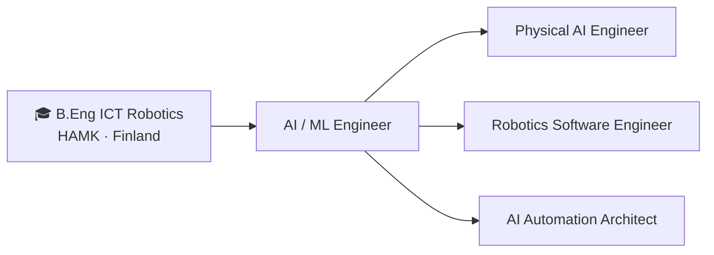
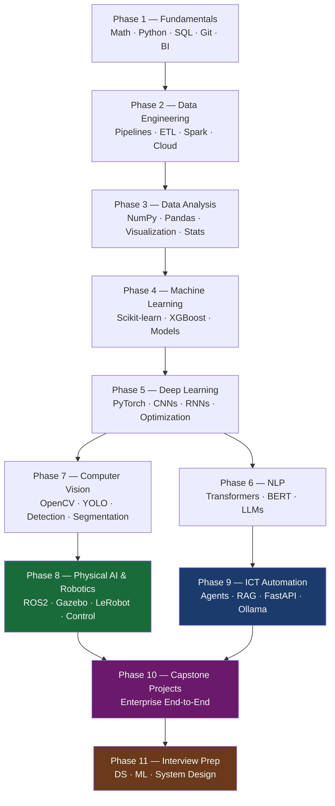

# Data Science & Physical AI Learning Path

> **Student:** B.Eng in ICT (Robotics) — HAMK University of Applied Sciences, Finland
> **Goal:** Physical AI Engineer | Robotics Software Engineer | AI Automation Architect

Preparing for roles in **ICT, ICT Automation, Industry Automation, Data Engineering, Intelligent Robotics, AI, Physical AI, and ML** — learning hands-on, step-by-step from fundamentals to advanced real-world systems.

---

## Career Target

**Core Stack:** Python · C++ · PyTorch · ROS2 · LLMs · Edge AI

---

## Learning Roadmap

| Phase | Section | Focus | Key Tools |
|-------|---------|-------|-----------|
| 1 | [Fundamentals](./01_Fundamentals/) | Math, Python, SQL, Git, BI Tools | Python, SQL, Git, Jupyter, Docker |
| 2 | [Data Engineering](./02_Data_Engineering/) | Pipelines, ETL, Cloud, Orchestration | Airflow, Spark, Kafka, dbt, Databricks |
| 3 | [Data Analysis](./03_Data_Analysis/) | NumPy, Pandas, Visualization, Statistics | Pandas, NumPy, Matplotlib, Seaborn, Plotly |
| 4 | [Machine Learning](./04_Machine_Learning/) | Supervised, Unsupervised, Scikit-learn | Scikit-learn, XGBoost, MLflow |
| 5 | [Deep Learning](./05_Deep_Learning/) | Neural Networks, PyTorch, CNNs, RNNs | PyTorch, TensorFlow, Keras |
| 6 | [NLP](./06_NLP/) | Text Processing, Transformers, LLMs | HuggingFace, spaCy, LangChain |
| 7 | [Computer Vision](./07_Machine_and_Computer_Vision/) | OpenCV, YOLO, Object Detection, Segmentation | OpenCV, YOLO, MediaPipe, Detectron2 |
| 8 | [Physical AI & Robotics](./08_Intelligent_Robotics_(Physical_AI)/) | ROS2, Gazebo, Spatial Intelligence, Control | ROS2, MoveIt2, LeRobot, Isaac Lab |
| 9 | [ICT Automation](./09_ICT_Automation/) | LLM Engineering, Agents, RAG, Automation | LangChain, LlamaIndex, FastAPI, Ollama |
| 10 | [Capstone Projects](./10_Top_High_Level_Projects/) | Enterprise-Grade End-to-End Projects | Full stack integration |
| 11 | [Interview Prep](./11_Interview_Prep/) | DS / ML / System Design Interview Prep | LeetCode, DataLemur, Kaggle |

---

## Tech Stack at a Glance

| Domain | Tools & Frameworks |
|--------|--------------------|
| **Languages** | Python · C++ · SQL |
| **Data Engineering** | Apache Airflow · Spark · Kafka · dbt · PySpark · Databricks |
| **Databases** | PostgreSQL · MySQL · MongoDB · BigQuery · Snowflake · DuckDB · Redis · Weaviate |
| **Visualization & BI** | Power BI · Tableau · Grafana · Matplotlib · Seaborn · Plotly |
| **ML / AI** | Scikit-learn · XGBoost · PyTorch · TensorFlow |
| **Computer Vision** | OpenCV · YOLO · MediaPipe · Detectron2 |
| **NLP & LLMs** | HuggingFace · LangChain · LlamaIndex · Ollama |
| **Robotics** | ROS2 · Gazebo · MoveIt2 · LeRobot · Isaac Lab · Beckhoff |
| **MLOps** | MLflow · DVC · Weights & Biases |
| **Cloud** | Microsoft Azure · Google Cloud |
| **DevOps** | Docker · Kubernetes · GitHub Actions · NGINX |
| **Backend** | FastAPI · Django · Node.js |

---

## Project Management & Collaboration

| Tool | Purpose |
|------|---------|
| GitHub | Version control, project repositories |
| Jira / ClickUp | Sprint and task management |
| Confluence | Documentation and knowledge base |
| Slack | Team communication |
| Trello / Microsoft Planner | Personal task planning |
